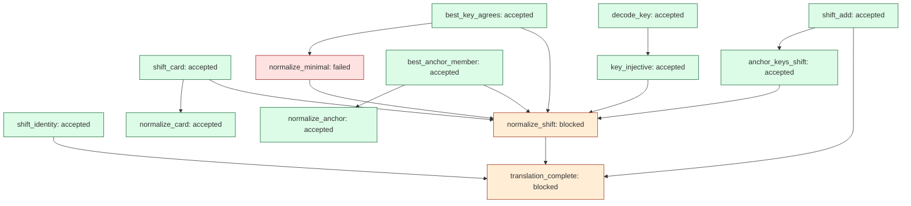

```mermaid
flowchart TD
    shift_identity["shift_identity: accepted"]:::accepted
    shift_add["shift_add: accepted"]:::accepted
    shift_card["shift_card: accepted"]:::accepted
    decode_key["decode_key: accepted"]:::accepted
    key_injective["key_injective: accepted"]:::accepted
    decode_key --> key_injective
    best_anchor_member["best_anchor_member: accepted"]:::accepted
    best_key_agrees["best_key_agrees: accepted"]:::accepted
    normalize_card["normalize_card: accepted"]:::accepted
    shift_card --> normalize_card
    normalize_anchor["normalize_anchor: accepted"]:::accepted
    best_anchor_member --> normalize_anchor
    normalize_minimal["normalize_minimal: failed"]:::failed
    best_key_agrees --> normalize_minimal
    anchor_keys_shift["anchor_keys_shift: accepted"]:::accepted
    shift_add --> anchor_keys_shift
    normalize_shift["normalize_shift: blocked"]:::blocked
    normalize_minimal --> normalize_shift
    anchor_keys_shift --> normalize_shift
    key_injective --> normalize_shift
    best_anchor_member --> normalize_shift
    best_key_agrees --> normalize_shift
    shift_card --> normalize_shift
    translation_complete["translation_complete: blocked"]:::blocked
    normalize_shift --> translation_complete
    shift_add --> translation_complete
    shift_identity --> translation_complete
    classDef accepted fill:#dcfce7,stroke:#166534
    classDef running fill:#dbeafe,stroke:#1d4ed8
    classDef planned fill:#f3f4f6,stroke:#6b7280,stroke-dasharray:5 5
    classDef failed fill:#fee2e2,stroke:#991b1b
    classDef blocked fill:#ffedd5,stroke:#9a3412
```
