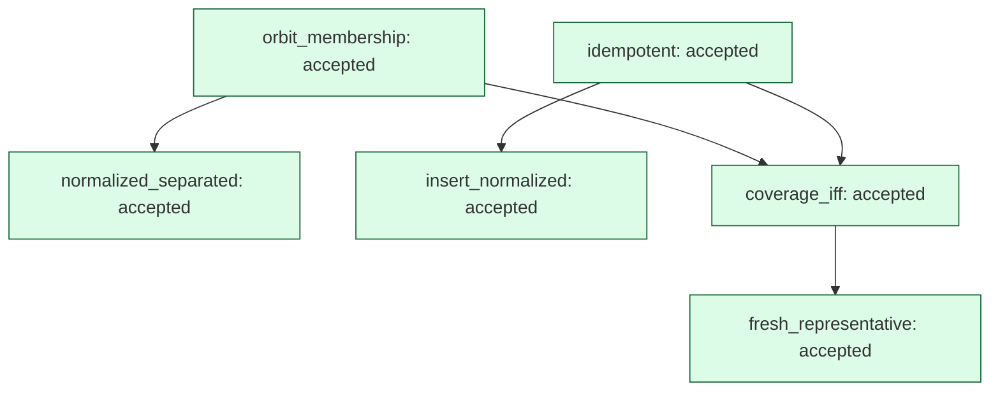

```mermaid
flowchart TD
    idempotent["idempotent: accepted"]:::accepted
    orbit_membership["orbit_membership: accepted"]:::accepted
    normalized_separated["normalized_separated: accepted"]:::accepted
    orbit_membership --> normalized_separated
    insert_normalized["insert_normalized: accepted"]:::accepted
    idempotent --> insert_normalized
    coverage_iff["coverage_iff: accepted"]:::accepted
    orbit_membership --> coverage_iff
    idempotent --> coverage_iff
    fresh_representative["fresh_representative: accepted"]:::accepted
    coverage_iff --> fresh_representative
    classDef accepted fill:#dcfce7,stroke:#166534
    classDef running fill:#dbeafe,stroke:#1d4ed8
    classDef planned fill:#f3f4f6,stroke:#6b7280,stroke-dasharray:5 5
    classDef failed fill:#fee2e2,stroke:#991b1b
    classDef blocked fill:#ffedd5,stroke:#9a3412
```
