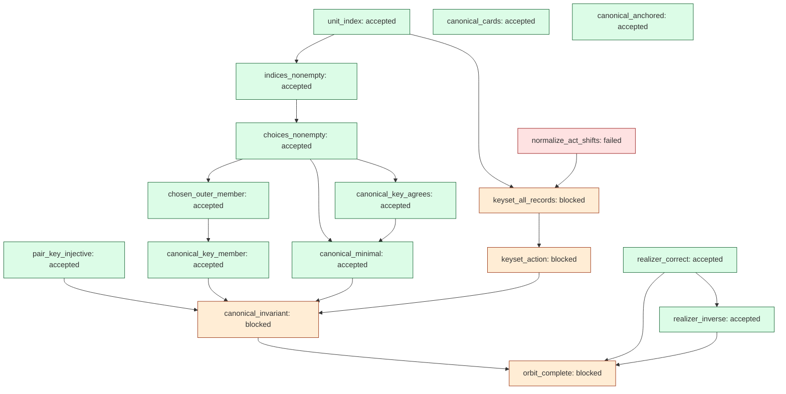

```mermaid
flowchart TD
    pair_key_injective["pair_key_injective: accepted"]:::accepted
    unit_index["unit_index: accepted"]:::accepted
    indices_nonempty["indices_nonempty: accepted"]:::accepted
    unit_index --> indices_nonempty
    choices_nonempty["choices_nonempty: accepted"]:::accepted
    indices_nonempty --> choices_nonempty
    chosen_outer_member["chosen_outer_member: accepted"]:::accepted
    choices_nonempty --> chosen_outer_member
    canonical_key_agrees["canonical_key_agrees: accepted"]:::accepted
    choices_nonempty --> canonical_key_agrees
    canonical_key_member["canonical_key_member: accepted"]:::accepted
    chosen_outer_member --> canonical_key_member
    canonical_minimal["canonical_minimal: accepted"]:::accepted
    choices_nonempty --> canonical_minimal
    canonical_key_agrees --> canonical_minimal
    realizer_correct["realizer_correct: accepted"]:::accepted
    realizer_inverse["realizer_inverse: accepted"]:::accepted
    realizer_correct --> realizer_inverse
    canonical_cards["canonical_cards: accepted"]:::accepted
    canonical_anchored["canonical_anchored: accepted"]:::accepted
    normalize_act_shifts["normalize_act_shifts: failed"]:::failed
    keyset_all_records["keyset_all_records: blocked"]:::blocked
    unit_index --> keyset_all_records
    normalize_act_shifts --> keyset_all_records
    keyset_action["keyset_action: blocked"]:::blocked
    keyset_all_records --> keyset_action
    canonical_invariant["canonical_invariant: blocked"]:::blocked
    pair_key_injective --> canonical_invariant
    canonical_key_member --> canonical_invariant
    canonical_minimal --> canonical_invariant
    keyset_action --> canonical_invariant
    orbit_complete["orbit_complete: blocked"]:::blocked
    canonical_invariant --> orbit_complete
    realizer_correct --> orbit_complete
    realizer_inverse --> orbit_complete
    classDef accepted fill:#dcfce7,stroke:#166534
    classDef running fill:#dbeafe,stroke:#1d4ed8
    classDef planned fill:#f3f4f6,stroke:#6b7280,stroke-dasharray:5 5
    classDef failed fill:#fee2e2,stroke:#991b1b
    classDef blocked fill:#ffedd5,stroke:#9a3412
```
