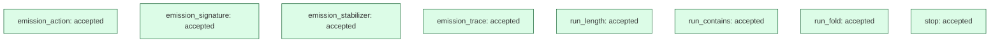

```mermaid
flowchart TD
    emission_action["emission_action: accepted"]:::accepted
    emission_signature["emission_signature: accepted"]:::accepted
    emission_stabilizer["emission_stabilizer: accepted"]:::accepted
    emission_trace["emission_trace: accepted"]:::accepted
    run_length["run_length: accepted"]:::accepted
    run_contains["run_contains: accepted"]:::accepted
    run_fold["run_fold: accepted"]:::accepted
    stop["stop: accepted"]:::accepted
    classDef accepted fill:#dcfce7,stroke:#166534
    classDef running fill:#dbeafe,stroke:#1d4ed8
    classDef planned fill:#f3f4f6,stroke:#6b7280,stroke-dasharray:5 5
    classDef failed fill:#fee2e2,stroke:#991b1b
    classDef blocked fill:#ffedd5,stroke:#9a3412
```
