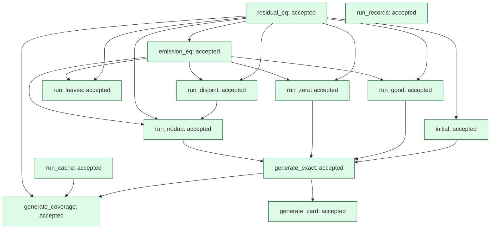

```mermaid
flowchart TD
    residual_eq["residual_eq: accepted"]:::accepted
    emission_eq["emission_eq: accepted"]:::accepted
    residual_eq --> emission_eq
    run_cache["run_cache: accepted"]:::accepted
    run_records["run_records: accepted"]:::accepted
    run_good["run_good: accepted"]:::accepted
    residual_eq --> run_good
    emission_eq --> run_good
    run_disjoint["run_disjoint: accepted"]:::accepted
    residual_eq --> run_disjoint
    emission_eq --> run_disjoint
    run_nodup["run_nodup: accepted"]:::accepted
    run_disjoint --> run_nodup
    residual_eq --> run_nodup
    emission_eq --> run_nodup
    run_leaves["run_leaves: accepted"]:::accepted
    residual_eq --> run_leaves
    emission_eq --> run_leaves
    run_zero["run_zero: accepted"]:::accepted
    residual_eq --> run_zero
    emission_eq --> run_zero
    initial["initial: accepted"]:::accepted
    residual_eq --> initial
    generate_exact["generate_exact: accepted"]:::accepted
    initial --> generate_exact
    run_good --> generate_exact
    run_zero --> generate_exact
    run_nodup --> generate_exact
    generate_coverage["generate_coverage: accepted"]:::accepted
    generate_exact --> generate_coverage
    run_cache --> generate_coverage
    residual_eq --> generate_coverage
    generate_card["generate_card: accepted"]:::accepted
    generate_exact --> generate_card
    classDef accepted fill:#dcfce7,stroke:#166534
    classDef running fill:#dbeafe,stroke:#1d4ed8
    classDef planned fill:#f3f4f6,stroke:#6b7280,stroke-dasharray:5 5
    classDef failed fill:#fee2e2,stroke:#991b1b
    classDef blocked fill:#ffedd5,stroke:#9a3412
```
