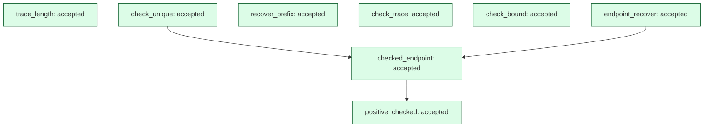

```mermaid
flowchart TD
    trace_length["trace_length: accepted"]:::accepted
    endpoint_recover["endpoint_recover: accepted"]:::accepted
    recover_prefix["recover_prefix: accepted"]:::accepted
    check_trace["check_trace: accepted"]:::accepted
    check_bound["check_bound: accepted"]:::accepted
    check_unique["check_unique: accepted"]:::accepted
    checked_endpoint["checked_endpoint: accepted"]:::accepted
    check_unique --> checked_endpoint
    endpoint_recover --> checked_endpoint
    positive_checked["positive_checked: accepted"]:::accepted
    checked_endpoint --> positive_checked
    classDef accepted fill:#dcfce7,stroke:#166534
    classDef running fill:#dbeafe,stroke:#1d4ed8
    classDef planned fill:#f3f4f6,stroke:#6b7280,stroke-dasharray:5 5
    classDef failed fill:#fee2e2,stroke:#991b1b
    classDef blocked fill:#ffedd5,stroke:#9a3412
```
