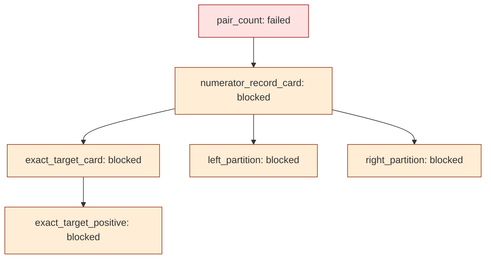

```mermaid
flowchart TD
    pair_count["pair_count: failed"]:::failed
    numerator_record_card["numerator_record_card: blocked"]:::blocked
    pair_count --> numerator_record_card
    exact_target_card["exact_target_card: blocked"]:::blocked
    numerator_record_card --> exact_target_card
    left_partition["left_partition: blocked"]:::blocked
    numerator_record_card --> left_partition
    right_partition["right_partition: blocked"]:::blocked
    numerator_record_card --> right_partition
    exact_target_positive["exact_target_positive: blocked"]:::blocked
    exact_target_card --> exact_target_positive
    classDef accepted fill:#dcfce7,stroke:#166534
    classDef running fill:#dbeafe,stroke:#1d4ed8
    classDef planned fill:#f3f4f6,stroke:#6b7280,stroke-dasharray:5 5
    classDef failed fill:#fee2e2,stroke:#991b1b
    classDef blocked fill:#ffedd5,stroke:#9a3412
```
