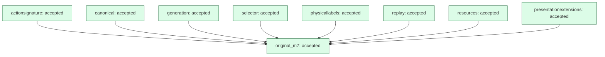

```mermaid
flowchart TD
    actionsignature["actionsignature: accepted"]:::accepted
    canonical["canonical: accepted"]:::accepted
    generation["generation: accepted"]:::accepted
    selector["selector: accepted"]:::accepted
    physicallabels["physicallabels: accepted"]:::accepted
    replay["replay: accepted"]:::accepted
    resources["resources: accepted"]:::accepted
    presentationextensions["presentationextensions: accepted"]:::accepted
    original_m7["original_m7: accepted"]:::accepted
    actionsignature --> original_m7
    canonical --> original_m7
    generation --> original_m7
    selector --> original_m7
    physicallabels --> original_m7
    replay --> original_m7
    resources --> original_m7
    presentationextensions --> original_m7
    classDef accepted fill:#dcfce7,stroke:#166534
    classDef running fill:#dbeafe,stroke:#1d4ed8
    classDef planned fill:#f3f4f6,stroke:#6b7280,stroke-dasharray:5 5
    classDef failed fill:#fee2e2,stroke:#991b1b
    classDef blocked fill:#ffedd5,stroke:#9a3412
```
