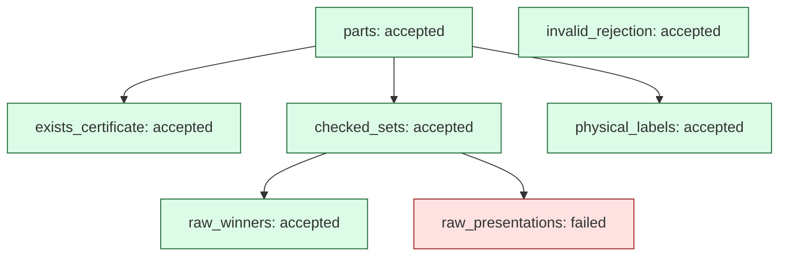

```mermaid
flowchart TD
    parts["parts: accepted"]:::accepted
    exists_certificate["exists_certificate: accepted"]:::accepted
    parts --> exists_certificate
    checked_sets["checked_sets: accepted"]:::accepted
    parts --> checked_sets
    raw_winners["raw_winners: accepted"]:::accepted
    checked_sets --> raw_winners
    raw_presentations["raw_presentations: failed"]:::failed
    checked_sets --> raw_presentations
    physical_labels["physical_labels: accepted"]:::accepted
    parts --> physical_labels
    invalid_rejection["invalid_rejection: accepted"]:::accepted
    classDef accepted fill:#dcfce7,stroke:#166534
    classDef running fill:#dbeafe,stroke:#1d4ed8
    classDef planned fill:#f3f4f6,stroke:#6b7280,stroke-dasharray:5 5
    classDef failed fill:#fee2e2,stroke:#991b1b
    classDef blocked fill:#ffedd5,stroke:#9a3412
```
