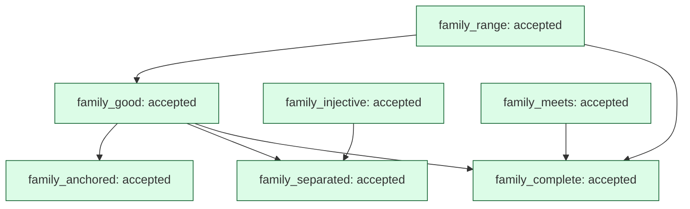

```mermaid
flowchart TD
    family_range["family_range: accepted"]:::accepted
    family_good["family_good: accepted"]:::accepted
    family_range --> family_good
    family_anchored["family_anchored: accepted"]:::accepted
    family_good --> family_anchored
    family_injective["family_injective: accepted"]:::accepted
    family_separated["family_separated: accepted"]:::accepted
    family_good --> family_separated
    family_injective --> family_separated
    family_meets["family_meets: accepted"]:::accepted
    family_complete["family_complete: accepted"]:::accepted
    family_range --> family_complete
    family_good --> family_complete
    family_meets --> family_complete
    classDef accepted fill:#dcfce7,stroke:#166534
    classDef running fill:#dbeafe,stroke:#1d4ed8
    classDef planned fill:#f3f4f6,stroke:#6b7280,stroke-dasharray:5 5
    classDef failed fill:#fee2e2,stroke:#991b1b
    classDef blocked fill:#ffedd5,stroke:#9a3412
```
