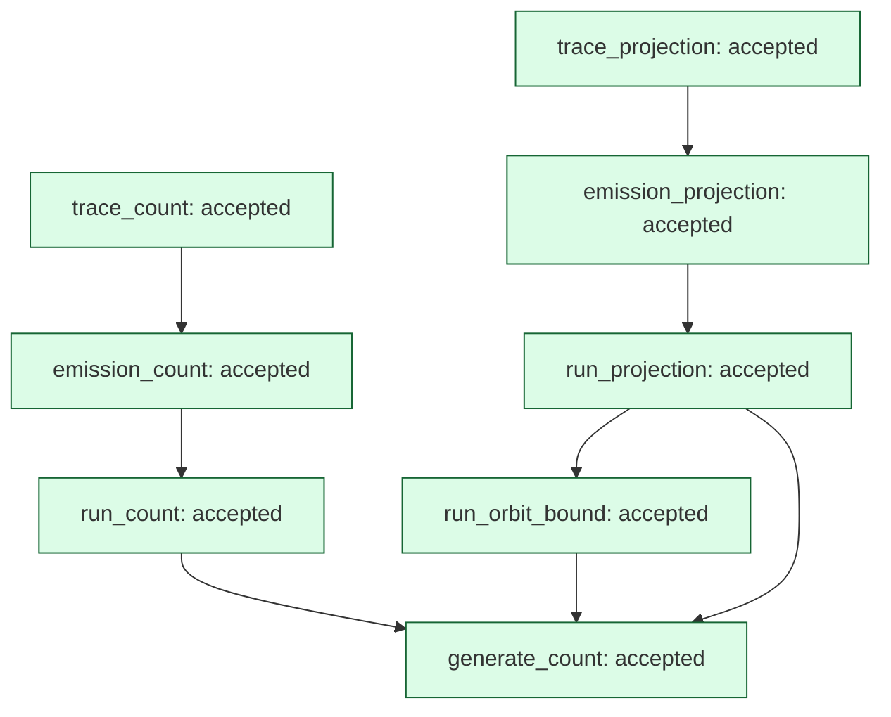

```mermaid
flowchart TD
    trace_projection["trace_projection: accepted"]:::accepted
    trace_count["trace_count: accepted"]:::accepted
    emission_projection["emission_projection: accepted"]:::accepted
    trace_projection --> emission_projection
    emission_count["emission_count: accepted"]:::accepted
    trace_count --> emission_count
    run_projection["run_projection: accepted"]:::accepted
    emission_projection --> run_projection
    run_count["run_count: accepted"]:::accepted
    emission_count --> run_count
    run_orbit_bound["run_orbit_bound: accepted"]:::accepted
    run_projection --> run_orbit_bound
    generate_count["generate_count: accepted"]:::accepted
    run_projection --> generate_count
    run_count --> generate_count
    run_orbit_bound --> generate_count
    classDef accepted fill:#dcfce7,stroke:#166534
    classDef running fill:#dbeafe,stroke:#1d4ed8
    classDef planned fill:#f3f4f6,stroke:#6b7280,stroke-dasharray:5 5
    classDef failed fill:#fee2e2,stroke:#991b1b
    classDef blocked fill:#ffedd5,stroke:#9a3412
```
