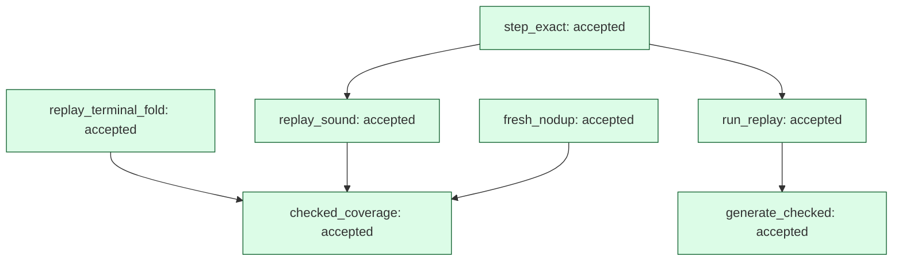

```mermaid
flowchart TD
    step_exact["step_exact: accepted"]:::accepted
    replay_terminal_fold["replay_terminal_fold: accepted"]:::accepted
    replay_sound["replay_sound: accepted"]:::accepted
    step_exact --> replay_sound
    fresh_nodup["fresh_nodup: accepted"]:::accepted
    run_replay["run_replay: accepted"]:::accepted
    step_exact --> run_replay
    generate_checked["generate_checked: accepted"]:::accepted
    run_replay --> generate_checked
    checked_coverage["checked_coverage: accepted"]:::accepted
    replay_terminal_fold --> checked_coverage
    replay_sound --> checked_coverage
    fresh_nodup --> checked_coverage
    classDef accepted fill:#dcfce7,stroke:#166534
    classDef running fill:#dbeafe,stroke:#1d4ed8
    classDef planned fill:#f3f4f6,stroke:#6b7280,stroke-dasharray:5 5
    classDef failed fill:#fee2e2,stroke:#991b1b
    classDef blocked fill:#ffedd5,stroke:#9a3412
```
