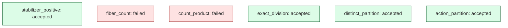

```mermaid
flowchart TD
    stabilizer_positive["stabilizer_positive: accepted"]:::accepted
    fiber_count["fiber_count: failed"]:::failed
    count_product["count_product: failed"]:::failed
    exact_division["exact_division: accepted"]:::accepted
    distinct_partition["distinct_partition: accepted"]:::accepted
    action_partition["action_partition: accepted"]:::accepted
    classDef accepted fill:#dcfce7,stroke:#166534
    classDef running fill:#dbeafe,stroke:#1d4ed8
    classDef planned fill:#f3f4f6,stroke:#6b7280,stroke-dasharray:5 5
    classDef failed fill:#fee2e2,stroke:#991b1b
    classDef blocked fill:#ffedd5,stroke:#9a3412
```
