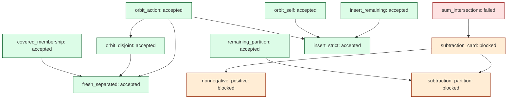

```mermaid
flowchart TD
    orbit_self["orbit_self: accepted"]:::accepted
    orbit_action["orbit_action: accepted"]:::accepted
    orbit_disjoint["orbit_disjoint: accepted"]:::accepted
    orbit_action --> orbit_disjoint
    covered_membership["covered_membership: accepted"]:::accepted
    sum_intersections["sum_intersections: failed"]:::failed
    subtraction_card["subtraction_card: blocked"]:::blocked
    sum_intersections --> subtraction_card
    nonnegative_positive["nonnegative_positive: blocked"]:::blocked
    subtraction_card --> nonnegative_positive
    remaining_partition["remaining_partition: accepted"]:::accepted
    subtraction_partition["subtraction_partition: blocked"]:::blocked
    subtraction_card --> subtraction_partition
    remaining_partition --> subtraction_partition
    insert_remaining["insert_remaining: accepted"]:::accepted
    fresh_separated["fresh_separated: accepted"]:::accepted
    orbit_action --> fresh_separated
    orbit_disjoint --> fresh_separated
    covered_membership --> fresh_separated
    insert_strict["insert_strict: accepted"]:::accepted
    insert_remaining --> insert_strict
    orbit_self --> insert_strict
    orbit_action --> insert_strict
    classDef accepted fill:#dcfce7,stroke:#166534
    classDef running fill:#dbeafe,stroke:#1d4ed8
    classDef planned fill:#f3f4f6,stroke:#6b7280,stroke-dasharray:5 5
    classDef failed fill:#fee2e2,stroke:#991b1b
    classDef blocked fill:#ffedd5,stroke:#9a3412
```
