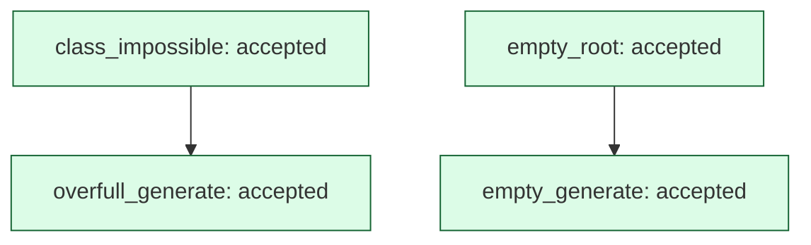

```mermaid
flowchart TD
    class_impossible["class_impossible: accepted"]:::accepted
    overfull_generate["overfull_generate: accepted"]:::accepted
    class_impossible --> overfull_generate
    empty_root["empty_root: accepted"]:::accepted
    empty_generate["empty_generate: accepted"]:::accepted
    empty_root --> empty_generate
    classDef accepted fill:#dcfce7,stroke:#166534
    classDef running fill:#dbeafe,stroke:#1d4ed8
    classDef planned fill:#f3f4f6,stroke:#6b7280,stroke-dasharray:5 5
    classDef failed fill:#fee2e2,stroke:#991b1b
    classDef blocked fill:#ffedd5,stroke:#9a3412
```
