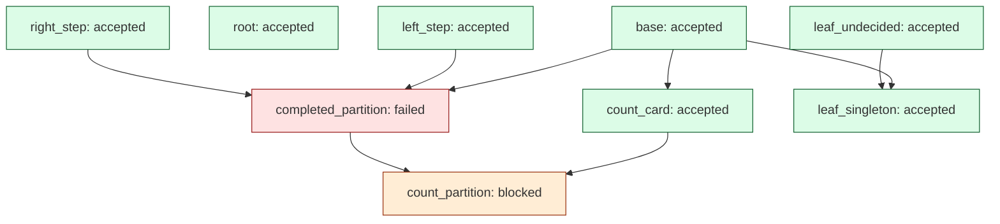

```mermaid
flowchart TD
    base["base: accepted"]:::accepted
    root["root: accepted"]:::accepted
    left_step["left_step: accepted"]:::accepted
    right_step["right_step: accepted"]:::accepted
    leaf_undecided["leaf_undecided: accepted"]:::accepted
    count_card["count_card: accepted"]:::accepted
    base --> count_card
    completed_partition["completed_partition: failed"]:::failed
    base --> completed_partition
    left_step --> completed_partition
    right_step --> completed_partition
    count_partition["count_partition: blocked"]:::blocked
    count_card --> count_partition
    completed_partition --> count_partition
    leaf_singleton["leaf_singleton: accepted"]:::accepted
    base --> leaf_singleton
    leaf_undecided --> leaf_singleton
    classDef accepted fill:#dcfce7,stroke:#166534
    classDef running fill:#dbeafe,stroke:#1d4ed8
    classDef planned fill:#f3f4f6,stroke:#6b7280,stroke-dasharray:5 5
    classDef failed fill:#fee2e2,stroke:#991b1b
    classDef blocked fill:#ffedd5,stroke:#9a3412
```
