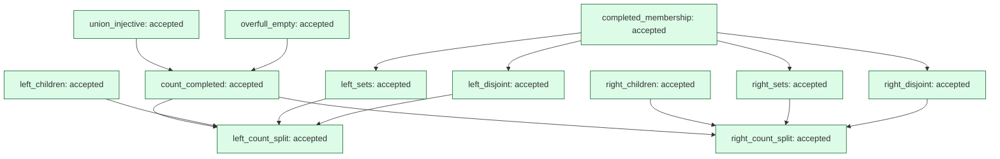

```mermaid
flowchart TD
    union_injective["union_injective: accepted"]:::accepted
    completed_membership["completed_membership: accepted"]:::accepted
    overfull_empty["overfull_empty: accepted"]:::accepted
    count_completed["count_completed: accepted"]:::accepted
    union_injective --> count_completed
    overfull_empty --> count_completed
    left_children["left_children: accepted"]:::accepted
    right_children["right_children: accepted"]:::accepted
    left_sets["left_sets: accepted"]:::accepted
    completed_membership --> left_sets
    right_sets["right_sets: accepted"]:::accepted
    completed_membership --> right_sets
    left_disjoint["left_disjoint: accepted"]:::accepted
    completed_membership --> left_disjoint
    right_disjoint["right_disjoint: accepted"]:::accepted
    completed_membership --> right_disjoint
    left_count_split["left_count_split: accepted"]:::accepted
    count_completed --> left_count_split
    left_children --> left_count_split
    left_sets --> left_count_split
    left_disjoint --> left_count_split
    right_count_split["right_count_split: accepted"]:::accepted
    count_completed --> right_count_split
    right_children --> right_count_split
    right_sets --> right_count_split
    right_disjoint --> right_count_split
    classDef accepted fill:#dcfce7,stroke:#166534
    classDef running fill:#dbeafe,stroke:#1d4ed8
    classDef planned fill:#f3f4f6,stroke:#6b7280,stroke-dasharray:5 5
    classDef failed fill:#fee2e2,stroke:#991b1b
    classDef blocked fill:#ffedd5,stroke:#9a3412
```
