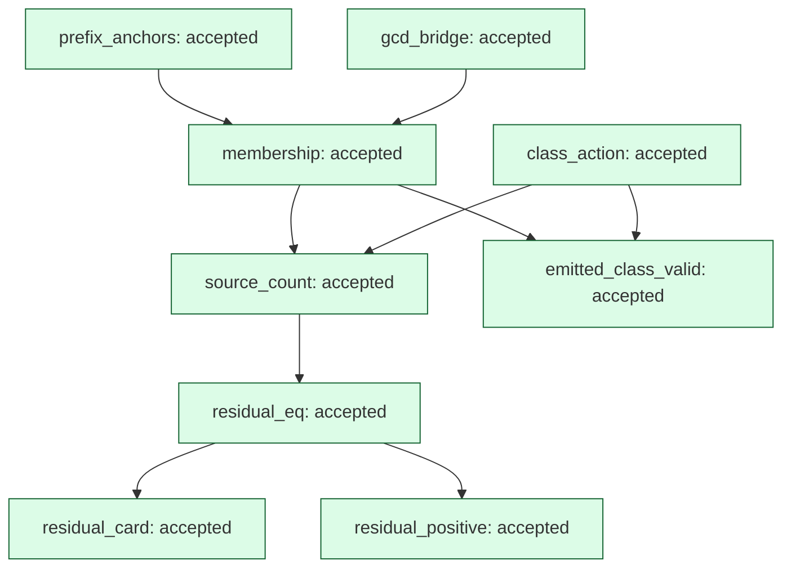

```mermaid
flowchart TD
    prefix_anchors["prefix_anchors: accepted"]:::accepted
    gcd_bridge["gcd_bridge: accepted"]:::accepted
    membership["membership: accepted"]:::accepted
    prefix_anchors --> membership
    gcd_bridge --> membership
    class_action["class_action: accepted"]:::accepted
    source_count["source_count: accepted"]:::accepted
    membership --> source_count
    class_action --> source_count
    residual_eq["residual_eq: accepted"]:::accepted
    source_count --> residual_eq
    residual_card["residual_card: accepted"]:::accepted
    residual_eq --> residual_card
    residual_positive["residual_positive: accepted"]:::accepted
    residual_eq --> residual_positive
    emitted_class_valid["emitted_class_valid: accepted"]:::accepted
    membership --> emitted_class_valid
    class_action --> emitted_class_valid
    classDef accepted fill:#dcfce7,stroke:#166534
    classDef running fill:#dbeafe,stroke:#1d4ed8
    classDef planned fill:#f3f4f6,stroke:#6b7280,stroke-dasharray:5 5
    classDef failed fill:#fee2e2,stroke:#991b1b
    classDef blocked fill:#ffedd5,stroke:#9a3412
```
