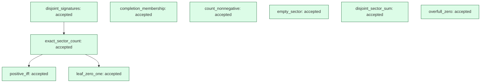

```mermaid
flowchart TD
    disjoint_signatures["disjoint_signatures: accepted"]:::accepted
    completion_membership["completion_membership: accepted"]:::accepted
    exact_sector_count["exact_sector_count: accepted"]:::accepted
    disjoint_signatures --> exact_sector_count
    count_nonnegative["count_nonnegative: accepted"]:::accepted
    positive_iff["positive_iff: accepted"]:::accepted
    exact_sector_count --> positive_iff
    empty_sector["empty_sector: accepted"]:::accepted
    disjoint_sector_sum["disjoint_sector_sum: accepted"]:::accepted
    overfull_zero["overfull_zero: accepted"]:::accepted
    leaf_zero_one["leaf_zero_one: accepted"]:::accepted
    exact_sector_count --> leaf_zero_one
    classDef accepted fill:#dcfce7,stroke:#166534
    classDef running fill:#dbeafe,stroke:#1d4ed8
    classDef planned fill:#f3f4f6,stroke:#6b7280,stroke-dasharray:5 5
    classDef failed fill:#fee2e2,stroke:#991b1b
    classDef blocked fill:#ffedd5,stroke:#9a3412
```
