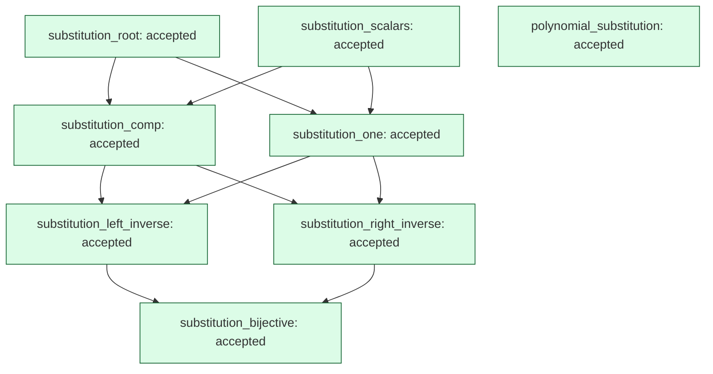

```mermaid
flowchart TD
    substitution_root["substitution_root: accepted"]:::accepted
    substitution_scalars["substitution_scalars: accepted"]:::accepted
    substitution_one["substitution_one: accepted"]:::accepted
    substitution_root --> substitution_one
    substitution_scalars --> substitution_one
    substitution_comp["substitution_comp: accepted"]:::accepted
    substitution_root --> substitution_comp
    substitution_scalars --> substitution_comp
    substitution_left_inverse["substitution_left_inverse: accepted"]:::accepted
    substitution_comp --> substitution_left_inverse
    substitution_one --> substitution_left_inverse
    substitution_right_inverse["substitution_right_inverse: accepted"]:::accepted
    substitution_comp --> substitution_right_inverse
    substitution_one --> substitution_right_inverse
    substitution_bijective["substitution_bijective: accepted"]:::accepted
    substitution_left_inverse --> substitution_bijective
    substitution_right_inverse --> substitution_bijective
    polynomial_substitution["polynomial_substitution: accepted"]:::accepted
    classDef accepted fill:#dcfce7,stroke:#166534
    classDef running fill:#dbeafe,stroke:#1d4ed8
    classDef planned fill:#f3f4f6,stroke:#6b7280,stroke-dasharray:5 5
    classDef failed fill:#fee2e2,stroke:#991b1b
    classDef blocked fill:#ffedd5,stroke:#9a3412
```
