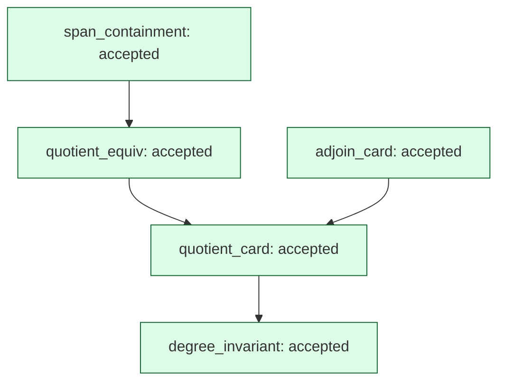

```mermaid
flowchart TD
    span_containment["span_containment: accepted"]:::accepted
    quotient_equiv["quotient_equiv: accepted"]:::accepted
    span_containment --> quotient_equiv
    adjoin_card["adjoin_card: accepted"]:::accepted
    quotient_card["quotient_card: accepted"]:::accepted
    quotient_equiv --> quotient_card
    adjoin_card --> quotient_card
    degree_invariant["degree_invariant: accepted"]:::accepted
    quotient_card --> degree_invariant
    classDef accepted fill:#dcfce7,stroke:#166534
    classDef running fill:#dbeafe,stroke:#1d4ed8
    classDef planned fill:#f3f4f6,stroke:#6b7280,stroke-dasharray:5 5
    classDef failed fill:#fee2e2,stroke:#991b1b
    classDef blocked fill:#ffedd5,stroke:#9a3412
```
