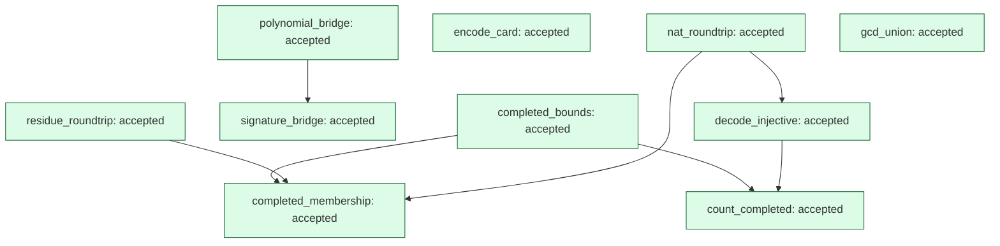

```mermaid
flowchart TD
    nat_roundtrip["nat_roundtrip: accepted"]:::accepted
    residue_roundtrip["residue_roundtrip: accepted"]:::accepted
    encode_card["encode_card: accepted"]:::accepted
    polynomial_bridge["polynomial_bridge: accepted"]:::accepted
    signature_bridge["signature_bridge: accepted"]:::accepted
    polynomial_bridge --> signature_bridge
    gcd_union["gcd_union: accepted"]:::accepted
    completed_bounds["completed_bounds: accepted"]:::accepted
    decode_injective["decode_injective: accepted"]:::accepted
    nat_roundtrip --> decode_injective
    completed_membership["completed_membership: accepted"]:::accepted
    nat_roundtrip --> completed_membership
    residue_roundtrip --> completed_membership
    completed_bounds --> completed_membership
    count_completed["count_completed: accepted"]:::accepted
    decode_injective --> count_completed
    completed_bounds --> count_completed
    classDef accepted fill:#dcfce7,stroke:#166534
    classDef running fill:#dbeafe,stroke:#1d4ed8
    classDef planned fill:#f3f4f6,stroke:#6b7280,stroke-dasharray:5 5
    classDef failed fill:#fee2e2,stroke:#991b1b
    classDef blocked fill:#ffedd5,stroke:#9a3412
```
