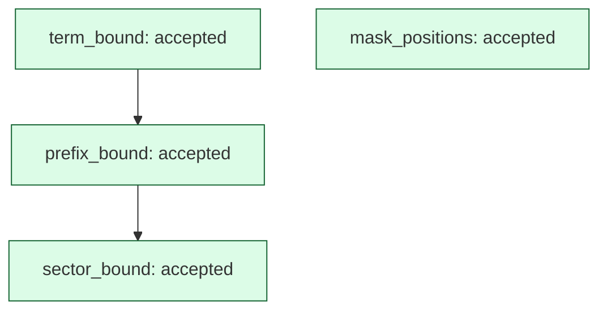

```mermaid
flowchart TD
    term_bound["term_bound: accepted"]:::accepted
    prefix_bound["prefix_bound: accepted"]:::accepted
    term_bound --> prefix_bound
    sector_bound["sector_bound: accepted"]:::accepted
    prefix_bound --> sector_bound
    mask_positions["mask_positions: accepted"]:::accepted
    classDef accepted fill:#dcfce7,stroke:#166534
    classDef running fill:#dbeafe,stroke:#1d4ed8
    classDef planned fill:#f3f4f6,stroke:#6b7280,stroke-dasharray:5 5
    classDef failed fill:#fee2e2,stroke:#991b1b
    classDef blocked fill:#ffedd5,stroke:#9a3412
```
