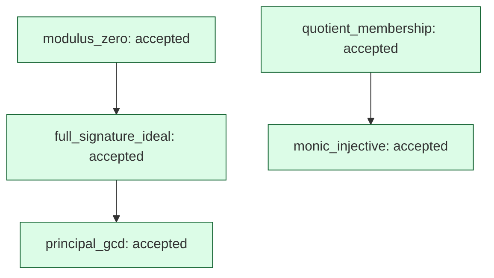

```mermaid
flowchart TD
    modulus_zero["modulus_zero: accepted"]:::accepted
    full_signature_ideal["full_signature_ideal: accepted"]:::accepted
    modulus_zero --> full_signature_ideal
    quotient_membership["quotient_membership: accepted"]:::accepted
    monic_injective["monic_injective: accepted"]:::accepted
    quotient_membership --> monic_injective
    principal_gcd["principal_gcd: accepted"]:::accepted
    full_signature_ideal --> principal_gcd
    classDef accepted fill:#dcfce7,stroke:#166534
    classDef running fill:#dbeafe,stroke:#1d4ed8
    classDef planned fill:#f3f4f6,stroke:#6b7280,stroke-dasharray:5 5
    classDef failed fill:#fee2e2,stroke:#991b1b
    classDef blocked fill:#ffedd5,stroke:#9a3412
```
