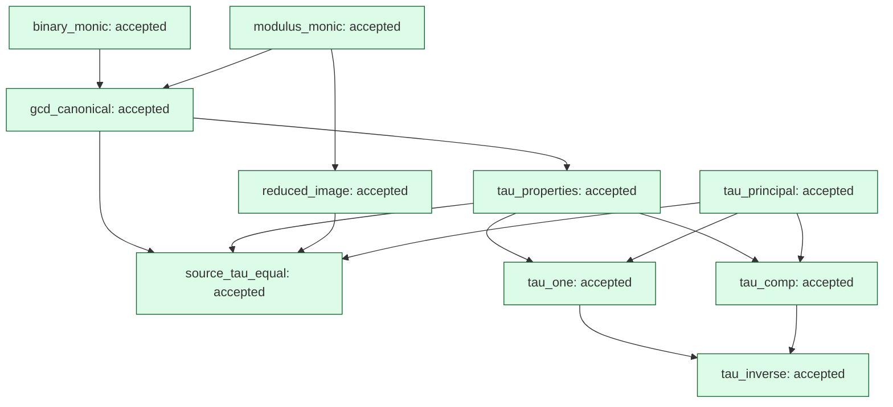

```mermaid
flowchart TD
    binary_monic["binary_monic: accepted"]:::accepted
    modulus_monic["modulus_monic: accepted"]:::accepted
    gcd_canonical["gcd_canonical: accepted"]:::accepted
    binary_monic --> gcd_canonical
    modulus_monic --> gcd_canonical
    tau_properties["tau_properties: accepted"]:::accepted
    gcd_canonical --> tau_properties
    reduced_image["reduced_image: accepted"]:::accepted
    modulus_monic --> reduced_image
    tau_principal["tau_principal: accepted"]:::accepted
    source_tau_equal["source_tau_equal: accepted"]:::accepted
    gcd_canonical --> source_tau_equal
    tau_properties --> source_tau_equal
    reduced_image --> source_tau_equal
    tau_principal --> source_tau_equal
    tau_one["tau_one: accepted"]:::accepted
    tau_properties --> tau_one
    tau_principal --> tau_one
    tau_comp["tau_comp: accepted"]:::accepted
    tau_properties --> tau_comp
    tau_principal --> tau_comp
    tau_inverse["tau_inverse: accepted"]:::accepted
    tau_one --> tau_inverse
    tau_comp --> tau_inverse
    classDef accepted fill:#dcfce7,stroke:#166534
    classDef running fill:#dbeafe,stroke:#1d4ed8
    classDef planned fill:#f3f4f6,stroke:#6b7280,stroke-dasharray:5 5
    classDef failed fill:#fee2e2,stroke:#991b1b
    classDef blocked fill:#ffedd5,stroke:#9a3412
```
