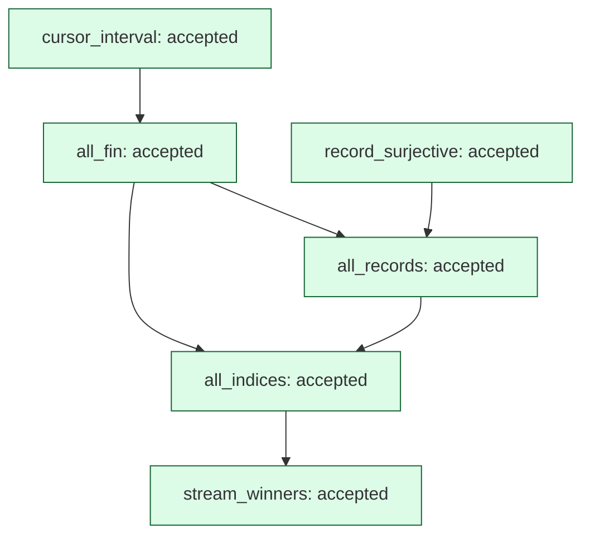

```mermaid
flowchart TD
    cursor_interval["cursor_interval: accepted"]:::accepted
    all_fin["all_fin: accepted"]:::accepted
    cursor_interval --> all_fin
    record_surjective["record_surjective: accepted"]:::accepted
    all_records["all_records: accepted"]:::accepted
    all_fin --> all_records
    record_surjective --> all_records
    all_indices["all_indices: accepted"]:::accepted
    all_fin --> all_indices
    all_records --> all_indices
    stream_winners["stream_winners: accepted"]:::accepted
    all_indices --> stream_winners
    classDef accepted fill:#dcfce7,stroke:#166534
    classDef running fill:#dbeafe,stroke:#1d4ed8
    classDef planned fill:#f3f4f6,stroke:#6b7280,stroke-dasharray:5 5
    classDef failed fill:#fee2e2,stroke:#991b1b
    classDef blocked fill:#ffedd5,stroke:#9a3412
```
