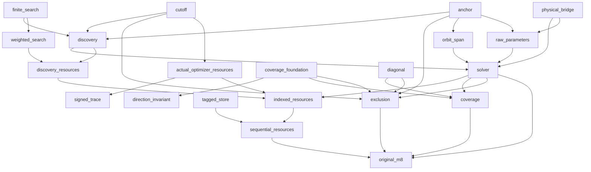

# M8 dependency plan

This is a dependency plan, not a proof receipt. Canonical counts and hashes are recorded in COMPONENT_STATUS.json. Each active batch uses two workers within the authorized sixteen-worker ceiling.

| Stage | Original obligation | Status |
|---|---|---|
| anchor | Actual anchor presentations and exact equivalence to zero-containing translation presentations | canonical accepted |
| cutoff | Fixed cutoff and parameter-free arithmetic envelopes | canonical accepted |
| physical_bridge | Actual all-order M6 optimizer, gcd degree and inverse physical witness transport | canonical accepted |
| finite_search | Actual first-success counter loop, exact lexicographic selection and measured callback visits | canonical accepted |
| discovery | Lexicographic finite enumeration, first passing tuple, exact failure and actual visited-trial bound | proof experiment or preflight active |
| solver | Three actual outcomes; NoLogical iff F=1; recognized iff full gcd nontrivial and orbit span within cutoff | planned or waiting for canonical parents |
| signed_trace | Actual recurrence coefficient magnitude, bit width, exact division and pinned query interface | planned or waiting for canonical parents |
| indexed_resources | Actual discovery, Euclid, trace and witness indexed-bit work and reusable storage | planned or waiting for canonical parents |
| sequential_resources | Tagged sequential-store simulation with original n^12 time and n^4 bit-space guarantees | planned or waiting for canonical parents |
| direction_invariant | Within-block generated subgroup invariant and proper separated-direction obstruction | planned or waiting for canonical parents |
| coverage | All three admitted infinite families, odd/even orders, full multiplicities, diagonal minimum distance and distinct nonproduct claim | planned or waiting for canonical parents |
| exclusion | Exact surviving complement; cardinality rejection; power-two antipodal rejected family | planned or waiting for canonical parents |
| original_m8 | Complete revised M8 source-bound closed root; no M9 or correctness/cost oracle | planned or waiting for canonical parents |
| orbit_span | Finite minimum of actual anchored orbit spans | canonical accepted |
| weighted_search | Exact executed-prefix callback and charge accumulation | proof experiment or preflight active |
| raw_parameters | Raw unanchored physical no-logical and encoded-dimension statements | proof experiment or preflight active |
| actual_optimizer_resources | Actual M6 optimizer work, storage and signed coefficient bounds | canonical accepted |
| tagged_store | Concrete binary tags and sequential read/write scans | proof experiment or preflight active |
| discovery_resources | Actual nested discovery schedule and binary upper-charge accumulation | planned or waiting for canonical parents |
| coverage_foundation | Actual within-block direction and proper-coset obstruction | canonical accepted |
| diagonal | Actual physical diagonal distance-two foundation | proof experiment or preflight active |
