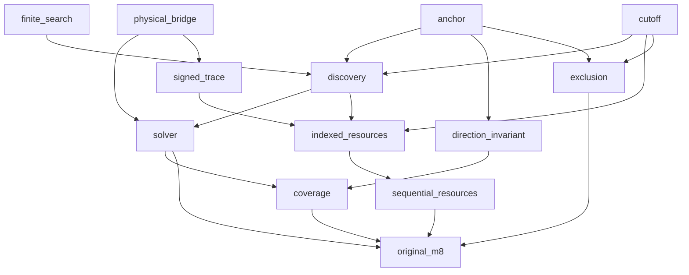

# M8 dependency plan

This is a scope/dependency plan, not a proof receipt. The first three batches can run independently; later batches wait for canonical parent receipts. Up to sixteen proof workers are authorized; current batches use two each.

| Stage | Original obligation |
| --- | --- |
| anchor | Actual anchor presentations and exact equivalence to zero-containing translation presentations |
| cutoff | Fixed cutoff and parameter-free arithmetic envelopes |
| physical_bridge | Actual all-order M6 optimizer, gcd degree and inverse physical witness transport |
| discovery | Lexicographic finite enumeration, first passing tuple, exact failure and actual visited-trial bound |
| solver | Three actual outcomes; NoLogical iff F=1; recognized iff full gcd nontrivial and orbit span within cutoff |
| signed_trace | Actual recurrence coefficient magnitude, bit width, exact division and pinned query interface |
| indexed_resources | Actual discovery, Euclid, trace and witness indexed-bit work and reusable storage |
| sequential_resources | Tagged sequential-store simulation with original n^12 time and n^4 bit-space guarantees |
| direction_invariant | Within-block generated subgroup invariant and proper separated-direction obstruction |
| coverage | All three admitted infinite families, odd/even orders, full multiplicities, diagonal minimum distance and distinct nonproduct claim |
| exclusion | Exact surviving complement; cardinality rejection; power-two antipodal rejected family |
| original_m8 | Complete revised M8 source-bound closed root; no M9 or correctness/cost oracle |

The finite_search sub-batch proves the concrete first-success cursor and its actual callback visit bound before the discovery composition.
