# M8 formalization dependencies

Full M8 acceptance: pending. Component status comes from verified canonical receipts.

```mermaid
graph TD
  anchor["anchor ✓"]
  cutoff["cutoff ✓"]
  physical_bridge["physical_bridge ✓"]
  finite_search["finite_search ✓"]
  discovery["discovery ✓"]
  anchor --> discovery
  cutoff --> discovery
  finite_search --> discovery
  solver["solver ✓"]
  discovery --> solver
  orbit_span --> solver
  physical_bridge --> solver
  raw_parameters --> solver
  sequential_resources["sequential_resources"]
  whole_resources --> sequential_resources
  sequential_store --> sequential_resources
  coverage["coverage"]
  solver --> coverage
  p3_family --> coverage
  p4_gcd --> coverage
  mixed_family --> coverage
  mixed_nonproduct --> coverage
  diagonal_polynomial --> coverage
  coverage_foundation --> coverage
  exclusion_conclusions["exclusion_conclusions"]
  solver --> exclusion_conclusions
  antipodal_family --> exclusion_conclusions
  exclusion_geometry --> exclusion_conclusions
  diagonal_polynomial --> exclusion_conclusions
  orbit_span["orbit_span ✓"]
  anchor --> orbit_span
  weighted_search["weighted_search ✓"]
  finite_search --> weighted_search
  raw_parameters["raw_parameters ✓"]
  physical_bridge --> raw_parameters
  anchor --> raw_parameters
  actual_optimizer_resources["actual_optimizer_resources ✓"]
  cutoff --> actual_optimizer_resources
  tagged_store["tagged_store ✓"]
  discovery_resources["discovery_resources ✓"]
  discovery --> discovery_resources
  weighted_search --> discovery_resources
  coverage_foundation["coverage_foundation ✓"]
  diagonal["diagonal ✓"]
  p3_family["p3_family ✓"]
  physical_bridge --> p3_family
  coverage_foundation --> p3_family
  cutoff --> p3_family
  anchor --> p3_family
  p4_family["p4_family ✓"]
  physical_bridge --> p4_family
  coverage_foundation --> p4_family
  cutoff --> p4_family
  anchor --> p4_family
  p4_gcd["p4_gcd ✓"]
  p4_family --> p4_gcd
  mixed_family["mixed_family ✓"]
  physical_bridge --> mixed_family
  coverage_foundation --> mixed_family
  cutoff --> mixed_family
  anchor --> mixed_family
  mixed_nonproduct["mixed_nonproduct"]
  mixed_family --> mixed_nonproduct
  diagonal_polynomial["diagonal_polynomial ✓"]
  diagonal --> diagonal_polynomial
  exclusion_geometry["exclusion_geometry ✓"]
  anchor --> exclusion_geometry
  antipodal_family["antipodal_family"]
  exclusion_geometry --> antipodal_family
  physical_bridge --> antipodal_family
  coverage_foundation --> antipodal_family
  cutoff --> antipodal_family
  bank_layout["bank_layout ✓"]
  actual_optimizer_resources --> bank_layout
  whole_resources["whole_resources"]
  solver --> whole_resources
  discovery_resources --> whole_resources
  actual_optimizer_resources --> whole_resources
  bank_layout --> whole_resources
  sequential_store -. slot gate .-> whole_resources
  final["final"]
  solver --> final
  raw_parameters --> final
  sequential_resources --> final
  sequential_store --> final
  whole_resources --> final
  coverage --> final
  exclusion_conclusions --> final
  sequential_store["sequential_store ✓"]
  bank_layout --> sequential_store
  tagged_store --> sequential_store
```

Model workers are capped at 16; individual batches use two. Solid edges are mathematical dependencies; dotted edges only govern worker reuse. The unstarted sharper weighted-sum follow-up is not a completion gate.
