# M8 dependency plan

This is a plan, not an acceptance receipt. Canonical hashes/counts are in COMPONENT_STATUS.json. Later batches wait for all canonical parents; the shared ceiling is sixteen model proof workers. Historical manuscript section labels are mapped to actual batches below, not counted as additional proof goals.

```mermaid
flowchart TD
  anchor["anchor"]
  cutoff["cutoff"]
  physical_bridge["physical_bridge"]
  finite_search["finite_search"]
  discovery["discovery"]
  anchor --> discovery
  cutoff --> discovery
  finite_search --> discovery
  solver["solver"]
  discovery --> solver
  orbit_span --> solver
  physical_bridge --> solver
  raw_parameters --> solver
  sequential_resources["sequential_resources"]
  whole_resources --> sequential_resources
  tagged_store --> sequential_resources
  coverage["coverage"]
  solver --> coverage
  p3_family --> coverage
  p4_gcd --> coverage
  mixed_family --> coverage
  mixed_nonproduct --> coverage
  diagonal_polynomial --> coverage
  coverage_foundation --> coverage
  exclusion["exclusion"]
  solver --> exclusion
  antipodal_family --> exclusion
  exclusion_geometry --> exclusion
  diagonal_polynomial --> exclusion
  orbit_span["orbit_span"]
  anchor --> orbit_span
  weighted_search["weighted_search"]
  finite_search --> weighted_search
  raw_parameters["raw_parameters"]
  physical_bridge --> raw_parameters
  anchor --> raw_parameters
  actual_optimizer_resources["actual_optimizer_resources"]
  cutoff --> actual_optimizer_resources
  tagged_store["tagged_store"]
  discovery_resources["discovery_resources"]
  discovery --> discovery_resources
  weighted_search --> discovery_resources
  coverage_foundation["coverage_foundation"]
  diagonal["diagonal"]
  p3_family["p3_family"]
  physical_bridge --> p3_family
  coverage_foundation --> p3_family
  cutoff --> p3_family
  anchor --> p3_family
  p4_family["p4_family"]
  physical_bridge --> p4_family
  coverage_foundation --> p4_family
  cutoff --> p4_family
  anchor --> p4_family
  p4_gcd["p4_gcd"]
  p4_family --> p4_gcd
  mixed_family["mixed_family"]
  physical_bridge --> mixed_family
  coverage_foundation --> mixed_family
  cutoff --> mixed_family
  anchor --> mixed_family
  mixed_nonproduct["mixed_nonproduct"]
  mixed_family --> mixed_nonproduct
  diagonal_polynomial["diagonal_polynomial"]
  diagonal --> diagonal_polynomial
  exclusion_geometry["exclusion_geometry"]
  anchor --> exclusion_geometry
  antipodal_family["antipodal_family"]
  exclusion_geometry --> antipodal_family
  physical_bridge --> antipodal_family
  coverage_foundation --> antipodal_family
  cutoff --> antipodal_family
  bank_layout["bank_layout"]
  actual_optimizer_resources --> bank_layout
  whole_resources["whole_resources"]
  solver --> whole_resources
  discovery_resources --> whole_resources
  actual_optimizer_resources --> whole_resources
  bank_layout --> whole_resources
  final["final"]
  solver --> final
  sequential_resources --> final
  coverage --> final
  exclusion --> final
```

| Stage | Original obligation | Status |
|---|---|---|
| anchor | Actual anchor presentations and exact equivalence to zero-containing translation presentations | canonical accepted |
| cutoff | Fixed cutoff and parameter-free arithmetic envelopes | canonical accepted |
| physical_bridge | Actual all-order M6 optimizer, gcd degree and inverse physical witness transport | canonical accepted |
| finite_search | Actual first-success counter loop, exact lexicographic selection and measured callback visits | canonical accepted |
| discovery | Lexicographic finite enumeration, first passing tuple, exact failure and actual visited-trial bound | proof experiment or preflight active |
| solver | Three actual outcomes; NoLogical iff F=1; recognized iff full gcd nontrivial and orbit span within cutoff | planned or waiting for canonical parents |
| sequential_resources | Tagged sequential-store simulation with original n^12 time and n^4 bit-space guarantees | planned or waiting for canonical parents |
| coverage | All three admitted infinite families, odd/even orders, full multiplicities, diagonal minimum distance and distinct nonproduct claim | planned or waiting for canonical parents |
| exclusion | Exact surviving complement; cardinality rejection; power-two antipodal rejected family | planned or waiting for canonical parents |
| orbit_span | Finite minimum of actual anchored orbit spans | canonical accepted |
| weighted_search | Exact executed-prefix callback and charge accumulation | canonical accepted |
| raw_parameters | Raw unanchored physical no-logical and encoded-dimension statements | canonical accepted |
| actual_optimizer_resources | Actual M6 optimizer work, storage and signed coefficient bounds | canonical accepted |
| tagged_store | Concrete binary tags and sequential read/write scans | canonical accepted |
| discovery_resources | Actual nested discovery schedule and binary upper-charge accumulation | planned or waiting for canonical parents |
| coverage_foundation | Actual within-block direction and proper-coset obstruction | canonical accepted |
| diagonal | Actual physical diagonal distance-two foundation | proof experiment or preflight active |
| p3_family | Literal all-order trinomial family foundations | planned or waiting for canonical parents |
| p4_family | Literal four-term family foundations | planned or waiting for canonical parents |
| p4_gcd | Full gcd multiplicity for all even orders, including N congruent2 modulo4 | planned or waiting for canonical parents |
| mixed_family | Literal mixed family and full gcd at all N>=7 | planned or waiting for canonical parents |
| mixed_nonproduct | Distinct actual cycle-space nonproduct property under recipe actions | planned or waiting for canonical parents |
| diagonal_polynomial | Actual polynomial nonunit to physical distance-two bridge | planned or waiting for canonical parents |
| exclusion_geometry | General support-cardinality and antipodal actual-orbit span obstructions | proof experiment or preflight active |
| antipodal_family | Literal sparse power-two family and full repeated-factor gcd | planned or waiting for canonical parents |
| bank_layout | Concrete reusable buffer layout and actual workspace embedding | planned or waiting for canonical parents |
| whole_resources | Actual algorithm branch charges and reusable layout | planned or waiting for canonical parents |
| final | Complete source-bound revised M8 root and acceptance audit | planned or waiting for canonical parents |
