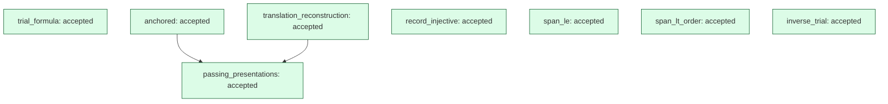

```mermaid
flowchart TD
    trial_formula["trial_formula: accepted"]:::accepted
    anchored["anchored: accepted"]:::accepted
    translation_reconstruction["translation_reconstruction: accepted"]:::accepted
    record_injective["record_injective: accepted"]:::accepted
    span_le["span_le: accepted"]:::accepted
    span_lt_order["span_lt_order: accepted"]:::accepted
    inverse_trial["inverse_trial: accepted"]:::accepted
    passing_presentations["passing_presentations: accepted"]:::accepted
    anchored --> passing_presentations
    translation_reconstruction --> passing_presentations
    classDef accepted fill:#dcfce7,stroke:#166534
    classDef running fill:#dbeafe,stroke:#1d4ed8
    classDef planned fill:#f3f4f6,stroke:#6b7280,stroke-dasharray:5 5
    classDef failed fill:#fee2e2,stroke:#991b1b
    classDef blocked fill:#ffedd5,stroke:#9a3412
```
