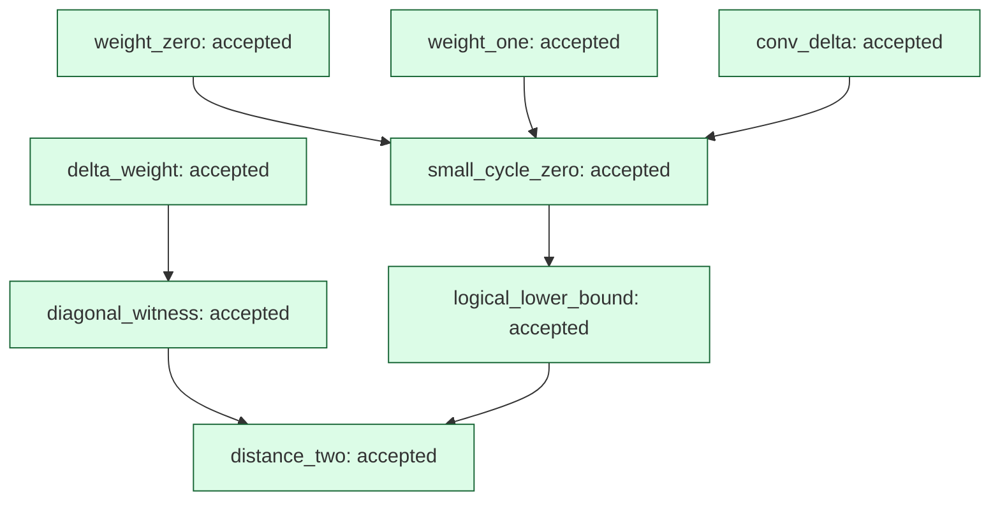

```mermaid
flowchart TD
    weight_zero["weight_zero: accepted"]:::accepted
    weight_one["weight_one: accepted"]:::accepted
    conv_delta["conv_delta: accepted"]:::accepted
    delta_weight["delta_weight: accepted"]:::accepted
    small_cycle_zero["small_cycle_zero: accepted"]:::accepted
    weight_zero --> small_cycle_zero
    weight_one --> small_cycle_zero
    conv_delta --> small_cycle_zero
    diagonal_witness["diagonal_witness: accepted"]:::accepted
    delta_weight --> diagonal_witness
    logical_lower_bound["logical_lower_bound: accepted"]:::accepted
    small_cycle_zero --> logical_lower_bound
    distance_two["distance_two: accepted"]:::accepted
    diagonal_witness --> distance_two
    logical_lower_bound --> distance_two
    classDef accepted fill:#dcfce7,stroke:#166534
    classDef running fill:#dbeafe,stroke:#1d4ed8
    classDef planned fill:#f3f4f6,stroke:#6b7280,stroke-dasharray:5 5
    classDef failed fill:#fee2e2,stroke:#991b1b
    classDef blocked fill:#ffedd5,stroke:#9a3412
```
