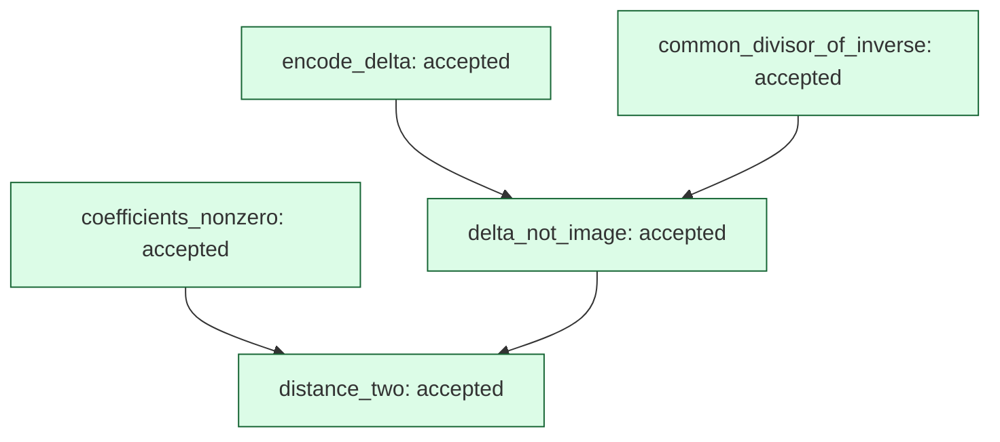

```mermaid
flowchart TD
    encode_delta["encode_delta: accepted"]:::accepted
    common_divisor_of_inverse["common_divisor_of_inverse: accepted"]:::accepted
    coefficients_nonzero["coefficients_nonzero: accepted"]:::accepted
    delta_not_image["delta_not_image: accepted"]:::accepted
    encode_delta --> delta_not_image
    common_divisor_of_inverse --> delta_not_image
    distance_two["distance_two: accepted"]:::accepted
    coefficients_nonzero --> distance_two
    delta_not_image --> distance_two
    classDef accepted fill:#dcfce7,stroke:#166534
    classDef running fill:#dbeafe,stroke:#1d4ed8
    classDef planned fill:#f3f4f6,stroke:#6b7280,stroke-dasharray:5 5
    classDef failed fill:#fee2e2,stroke:#991b1b
    classDef blocked fill:#ffedd5,stroke:#9a3412
```
