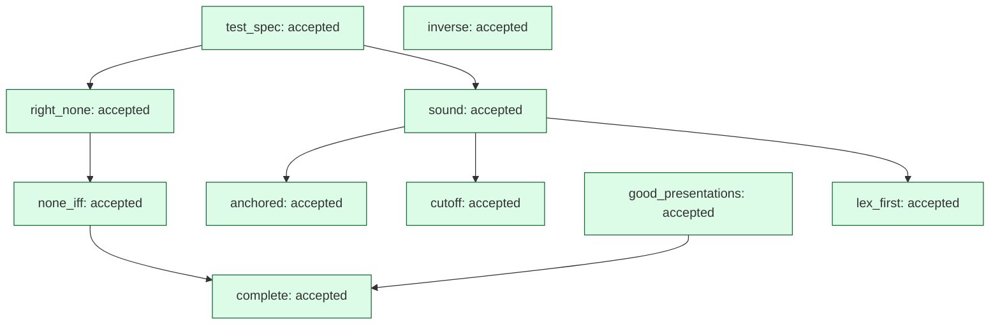

```mermaid
flowchart TD
    test_spec["test_spec: accepted"]:::accepted
    right_none["right_none: accepted"]:::accepted
    test_spec --> right_none
    none_iff["none_iff: accepted"]:::accepted
    right_none --> none_iff
    sound["sound: accepted"]:::accepted
    test_spec --> sound
    anchored["anchored: accepted"]:::accepted
    sound --> anchored
    cutoff["cutoff: accepted"]:::accepted
    sound --> cutoff
    good_presentations["good_presentations: accepted"]:::accepted
    complete["complete: accepted"]:::accepted
    none_iff --> complete
    good_presentations --> complete
    inverse["inverse: accepted"]:::accepted
    lex_first["lex_first: accepted"]:::accepted
    sound --> lex_first
    classDef accepted fill:#dcfce7,stroke:#166534
    classDef running fill:#dbeafe,stroke:#1d4ed8
    classDef planned fill:#f3f4f6,stroke:#6b7280,stroke-dasharray:5 5
    classDef failed fill:#fee2e2,stroke:#991b1b
    classDef blocked fill:#ffedd5,stroke:#9a3412
```
