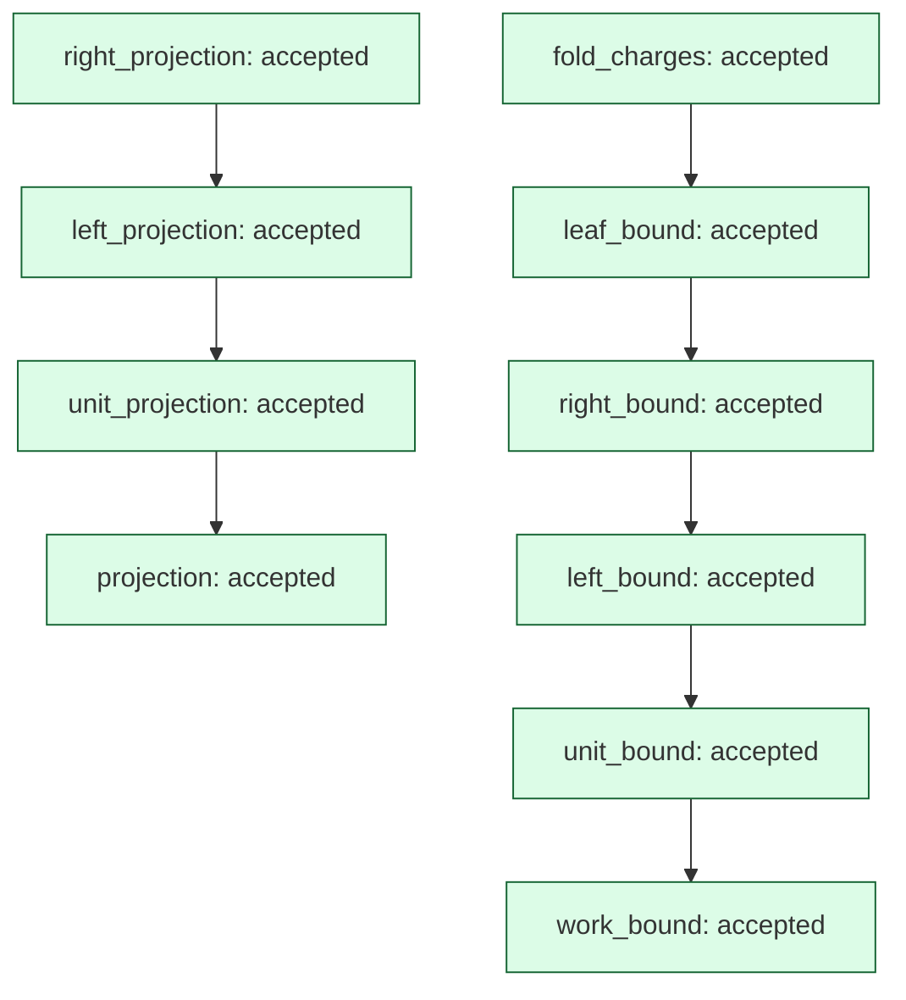

```mermaid
flowchart TD
    fold_charges["fold_charges: accepted"]:::accepted
    leaf_bound["leaf_bound: accepted"]:::accepted
    fold_charges --> leaf_bound
    right_projection["right_projection: accepted"]:::accepted
    left_projection["left_projection: accepted"]:::accepted
    right_projection --> left_projection
    unit_projection["unit_projection: accepted"]:::accepted
    left_projection --> unit_projection
    projection["projection: accepted"]:::accepted
    unit_projection --> projection
    right_bound["right_bound: accepted"]:::accepted
    leaf_bound --> right_bound
    left_bound["left_bound: accepted"]:::accepted
    right_bound --> left_bound
    unit_bound["unit_bound: accepted"]:::accepted
    left_bound --> unit_bound
    work_bound["work_bound: accepted"]:::accepted
    unit_bound --> work_bound
    classDef accepted fill:#dcfce7,stroke:#166534
    classDef running fill:#dbeafe,stroke:#1d4ed8
    classDef planned fill:#f3f4f6,stroke:#6b7280,stroke-dasharray:5 5
    classDef failed fill:#fee2e2,stroke:#991b1b
    classDef blocked fill:#ffedd5,stroke:#9a3412
```
