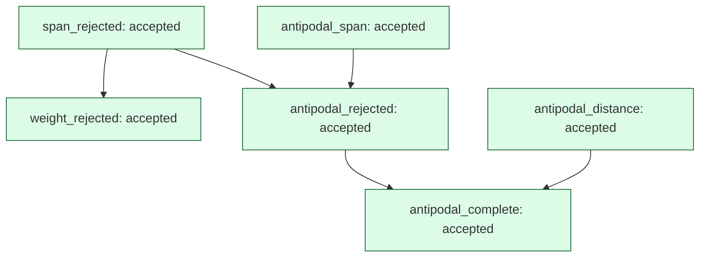

```mermaid
flowchart TD
    span_rejected["span_rejected: accepted"]:::accepted
    weight_rejected["weight_rejected: accepted"]:::accepted
    span_rejected --> weight_rejected
    antipodal_span["antipodal_span: accepted"]:::accepted
    antipodal_distance["antipodal_distance: accepted"]:::accepted
    antipodal_rejected["antipodal_rejected: accepted"]:::accepted
    span_rejected --> antipodal_rejected
    antipodal_span --> antipodal_rejected
    antipodal_complete["antipodal_complete: accepted"]:::accepted
    antipodal_rejected --> antipodal_complete
    antipodal_distance --> antipodal_complete
    classDef accepted fill:#dcfce7,stroke:#166534
    classDef running fill:#dbeafe,stroke:#1d4ed8
    classDef planned fill:#f3f4f6,stroke:#6b7280,stroke-dasharray:5 5
    classDef failed fill:#fee2e2,stroke:#991b1b
    classDef blocked fill:#ffedd5,stroke:#9a3412
```
