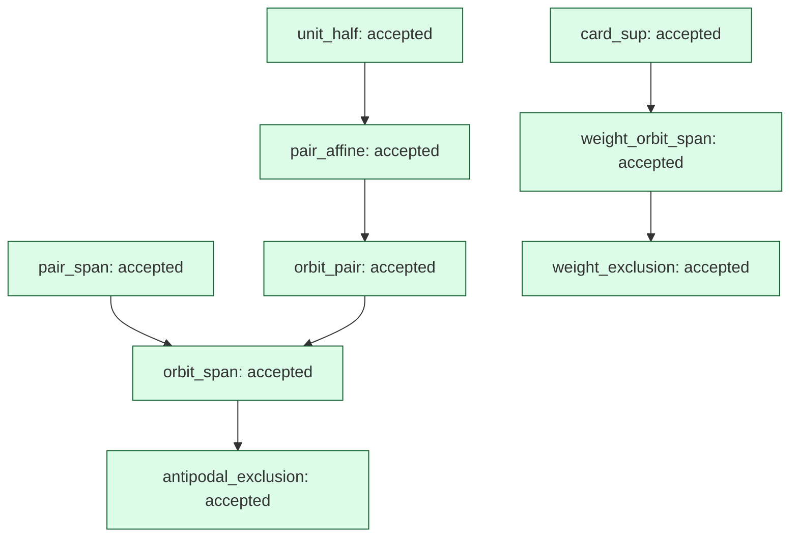

```mermaid
flowchart TD
    unit_half["unit_half: accepted"]:::accepted
    pair_affine["pair_affine: accepted"]:::accepted
    unit_half --> pair_affine
    pair_span["pair_span: accepted"]:::accepted
    orbit_pair["orbit_pair: accepted"]:::accepted
    pair_affine --> orbit_pair
    orbit_span["orbit_span: accepted"]:::accepted
    pair_span --> orbit_span
    orbit_pair --> orbit_span
    card_sup["card_sup: accepted"]:::accepted
    weight_orbit_span["weight_orbit_span: accepted"]:::accepted
    card_sup --> weight_orbit_span
    weight_exclusion["weight_exclusion: accepted"]:::accepted
    weight_orbit_span --> weight_exclusion
    antipodal_exclusion["antipodal_exclusion: accepted"]:::accepted
    orbit_span --> antipodal_exclusion
    classDef accepted fill:#dcfce7,stroke:#166534
    classDef running fill:#dbeafe,stroke:#1d4ed8
    classDef planned fill:#f3f4f6,stroke:#6b7280,stroke-dasharray:5 5
    classDef failed fill:#fee2e2,stroke:#991b1b
    classDef blocked fill:#ffedd5,stroke:#9a3412
```
