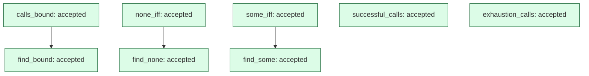

```mermaid
flowchart TD
    calls_bound["calls_bound: accepted"]:::accepted
    none_iff["none_iff: accepted"]:::accepted
    some_iff["some_iff: accepted"]:::accepted
    successful_calls["successful_calls: accepted"]:::accepted
    find_none["find_none: accepted"]:::accepted
    none_iff --> find_none
    find_some["find_some: accepted"]:::accepted
    some_iff --> find_some
    find_bound["find_bound: accepted"]:::accepted
    calls_bound --> find_bound
    exhaustion_calls["exhaustion_calls: accepted"]:::accepted
    classDef accepted fill:#dcfce7,stroke:#166534
    classDef running fill:#dbeafe,stroke:#1d4ed8
    classDef planned fill:#f3f4f6,stroke:#6b7280,stroke-dasharray:5 5
    classDef failed fill:#fee2e2,stroke:#991b1b
    classDef blocked fill:#ffedd5,stroke:#9a3412
```
