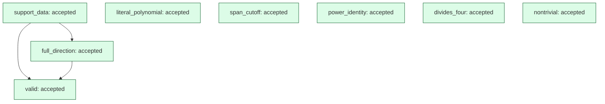

```mermaid
flowchart TD
    support_data["support_data: accepted"]:::accepted
    literal_polynomial["literal_polynomial: accepted"]:::accepted
    full_direction["full_direction: accepted"]:::accepted
    support_data --> full_direction
    valid["valid: accepted"]:::accepted
    support_data --> valid
    full_direction --> valid
    span_cutoff["span_cutoff: accepted"]:::accepted
    power_identity["power_identity: accepted"]:::accepted
    divides_four["divides_four: accepted"]:::accepted
    nontrivial["nontrivial: accepted"]:::accepted
    classDef accepted fill:#dcfce7,stroke:#166534
    classDef running fill:#dbeafe,stroke:#1d4ed8
    classDef planned fill:#f3f4f6,stroke:#6b7280,stroke-dasharray:5 5
    classDef failed fill:#fee2e2,stroke:#991b1b
    classDef blocked fill:#ffedd5,stroke:#9a3412
```
