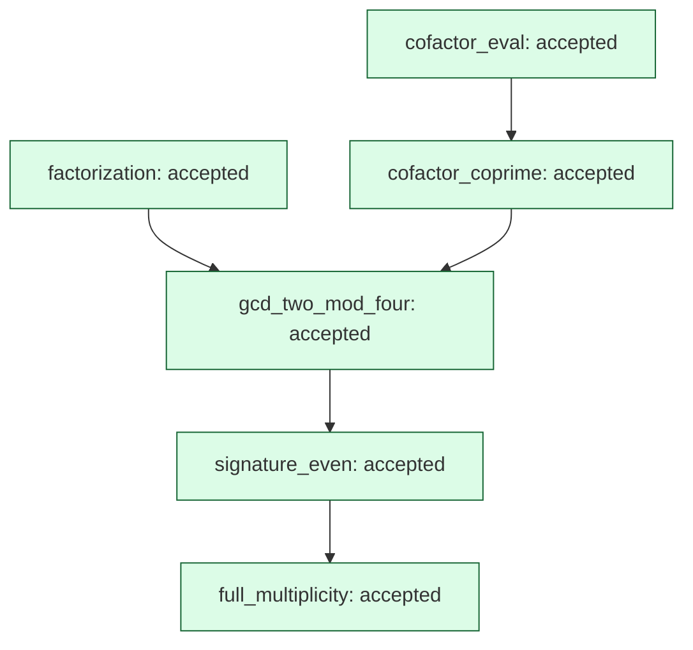

```mermaid
flowchart TD
    factorization["factorization: accepted"]:::accepted
    cofactor_eval["cofactor_eval: accepted"]:::accepted
    cofactor_coprime["cofactor_coprime: accepted"]:::accepted
    cofactor_eval --> cofactor_coprime
    gcd_two_mod_four["gcd_two_mod_four: accepted"]:::accepted
    factorization --> gcd_two_mod_four
    cofactor_coprime --> gcd_two_mod_four
    signature_even["signature_even: accepted"]:::accepted
    gcd_two_mod_four --> signature_even
    full_multiplicity["full_multiplicity: accepted"]:::accepted
    signature_even --> full_multiplicity
    classDef accepted fill:#dcfce7,stroke:#166534
    classDef running fill:#dbeafe,stroke:#1d4ed8
    classDef planned fill:#f3f4f6,stroke:#6b7280,stroke-dasharray:5 5
    classDef failed fill:#fee2e2,stroke:#991b1b
    classDef blocked fill:#ffedd5,stroke:#9a3412
```
