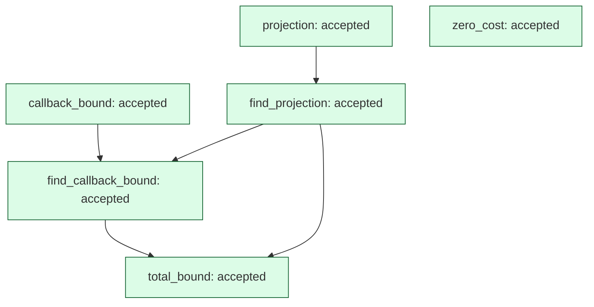

```mermaid
flowchart TD
    projection["projection: accepted"]:::accepted
    callback_bound["callback_bound: accepted"]:::accepted
    zero_cost["zero_cost: accepted"]:::accepted
    find_projection["find_projection: accepted"]:::accepted
    projection --> find_projection
    find_callback_bound["find_callback_bound: accepted"]:::accepted
    callback_bound --> find_callback_bound
    find_projection --> find_callback_bound
    total_bound["total_bound: accepted"]:::accepted
    find_callback_bound --> total_bound
    find_projection --> total_bound
    classDef accepted fill:#dcfce7,stroke:#166534
    classDef running fill:#dbeafe,stroke:#1d4ed8
    classDef planned fill:#f3f4f6,stroke:#6b7280,stroke-dasharray:5 5
    classDef failed fill:#fee2e2,stroke:#991b1b
    classDef blocked fill:#ffedd5,stroke:#9a3412
```
